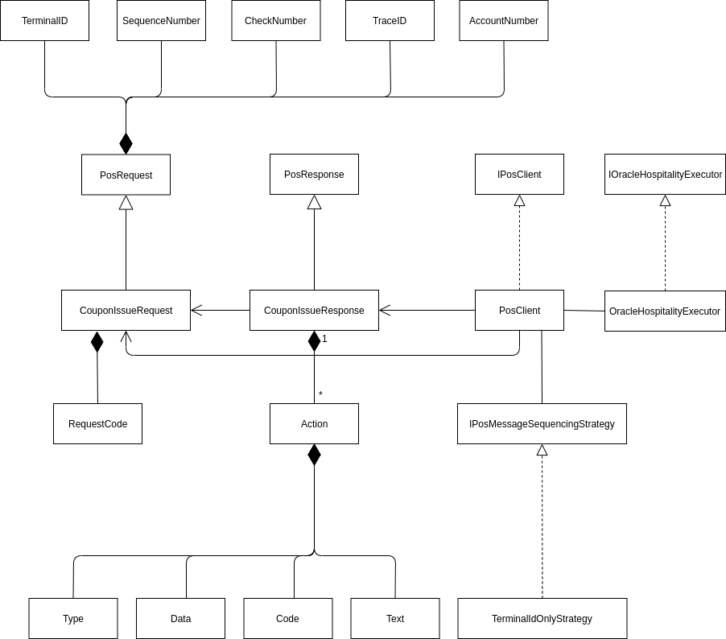

# Bugfree.OracleHospitality

This repository contains .NET 5.0 clients for interfacing with the Oracle
Hospitality, Gift & Loyalty Point of Sale (POS) and Customer Relationship
Management (CRM) web services.

Business applications can rely on these clients to compose the request XML,
wrapping it inside a SOAP request, and sending it as an HTTP request to Oracle's
backend. When the SOAP response comes back, these clients unwrap the response
XML and turns it into strongly typed .NET objects.

On the diagram below, YourClient depends on Clients, exposing the POS and CRM
client interfaces. For troubleshooting, debugging, and scripting, clients are
also exposed through a command-line interface whose operations are listed under
[Command-line interface](#command-line-interface):

<!---->


## NuGet package

Follow [these](https://www.nuget.org/packages/Bugfree.OracleHospitality.Clients/) instructions.

## Clone, build, and test

    % git clone https://github.com/ronnieholm/Bugfree.OracleHospitality.git
    % cd Bugfree.OracleHospitality
    % dotnet build
    % dotnet test Bugfree.OracleHospitality.UnitTests

## Configure clients for use with YourClient

After adding a reference to Bugfree.OracleHospitality.Clients to YourProject,
the YourProject Startup.cs must ensure that client settings are available and
that the dependency injection container includes the clients and their
dependencies:

```csharp
public static IServiceCollection AddFileConfiguration(this IServiceCollection services)
{
    var builder = new ConfigurationBuilder()
        .SetBasePath(Path.GetDirectoryName(Assembly.GetExecutingAssembly().Location))
        .AddJsonFile("appsettings.json", optional: true, reloadOnChange: true)
        .Build();

    services.Configure<OracleHospitalityClientsOptions>(builder.GetSection("OracleHospitalityClients"));
    var clientOptions = services.BuildServiceProvider().GetRequiredService<IOptions<OracleHospitalityClientsOptions>>();
    clientOptions.Value.Validate();
    return services;
}

private static IServiceProvider ConfigureServices(IServiceCollection serviceCollection)
{
    return serviceCollection
        .AddFileConfiguration()
        .AddSingleton<IPosMessageSequencingStrategy, TerminalIdOnlyStrategy>()
        .AddScoped<IPosClient, PosClient>()
        .AddScoped<ICrmClient, CrmClient>()
        .AddHttpClient<IOracleHospitalityExecutor, OracleHospitalityExecutor>();
        .BuildServiceProvider();
}
```

Now `IPosClient` and `ICrmClient` can be injected into any class. Assuming
YourClient uses file configuration, this section must be added to its
`appsettings.json`:

```json
{
  "OracleHospitalityClients": {
    "StoredValueServiceUrl": "https://mte<00>-ohgl-prod.hospitality.oracleindustry.com:9443/ws/services/StoredValueService",
    "LogonName": "<LogonName>",
    "Password": "<Password>",
    "PointOfSaleOperations": {
      "TerminalIdLowerBound": 0,
      "TerminalIdUpperBound": 1000000
    },
    "CustomerRelationshipManagementOperations": {
      "RequestSourceName": "<acme.com>"
    }
  }
}
```

Setting `TerminalIdLowerBound` and `TerminalIdUpperBound` enables safely calling
into the POS client in a multi-threaded environment, such as a web application.
With these settings, each call to a POS operation appears to the Oracle backend
as originating from a different terminal id in the range. `RequestSourceName` is
passed with each request to the backend to identify the clients in log files.

## Command-line interface

`Bugfree.OracleHospitality.Cli` may exercise POS and CRM clients from the
command-line. The tool is a thin wrapper around the clients and supports every
POS and CRM operation exposed by those:

    % cd Bugfree.OracleHospitality.Cli/bin/Debug/net5.0
    % ./Bugfree.OracleHospitality.Cli point-issue --account-number 123
    % ./Bugfree.OracleHospitality.Cli coupon-inquiry --account-number 123
    % ./Bugfree.OracleHospitality.Cli coupon-issue --account-number 123 --coupon-code coffee
    % ./Bugfree.OracleHospitality.Cli coupon-accept --account-number 123 --coupon-code 456
    % ./Bugfree.OracleHospitality.Cli get-column-list --request customer
    % ./Bugfree.OracleHospitality.Cli get-customer --conditions "primaryposref = ?" --column-values primaryposref 123 --columns firstname lastname
    % ./Bugfree.OracleHospitality.Cli get-account --conditions "accountposref = ?" --column-values accountposref 123 --columns programid
    % ./Bugfree.OracleHospitality.Cli get-coupons --conditions "accountposref = ?" --column-values accountposref 123
    % ./Bugfree.OracleHospitality.Cli get-program --conditions "programid = ?" --column-values programid 456 --columns programcode
    % ./Bugfree.OracleHospitality.Cli set-customer --row-id 123 --column-values firstname John lastname Doe
    % ./Bugfree.OracleHospitality.Cli post-account-transaction --type ReopenAccount --program-code EMPDISC --account-pos-ref 123
    % ./Bugfree.OracleHospitality.Cli guid-to-account-number --guid d87f3626-ab52-4fd6-bd6c-a2dcdc1117e6

The tool serves a dual purpose as an example of how to register POS and CRM
clients with the .NET dependency injection container and how call into the
clients library.

The `guid-to-account-number` isn't an operation as such. It provides a means to
use (sequential) GUIDs as account numbers by
[mapping](http://bugfree.dk/blog/2019/09/18/randomizing-and-encoding-sequential-guids-in-a-larger-alphabet)
a GUID to a 21 digit account numbers, leaving room for a three digit preamble.
The mapping is done in such a way that as much of the original GUID is
preserved, reducing the risk of collisions.

## Detailed class diagram

The POS and CRM clients encode Oracle’s API specifications, adopting Oracle’s
domain language, and internally are organized as shown below. Rather than
including every class, a representative sample of the `CouponIssue` operation is
shown:

<!--  -->


YourClient calls an `IPosClient` or `ICrmClient` method such as `CouponIssue`.
The XML request is then composed from an aggregate of objects modeling parts of
the request. `OracleHospitalityExecutor` takes this XML request, wraps it in a
SOAP request and send it as an HTTP request. When the SOAP response comes back,
the executor unwraps its response XML. A response object then parses it into its
parts. Specific to the POS API is the sequencing of operations. Each POS
operation must include a unique message ID. The simplest one is
`TermindIdOnlyStrategy`, incrementing the terminal ID with each request.

## Resources

- [Oracle Hospitality Enterprise Back Office 8.5
  documentation](https://docs.oracle.com/cd/E66143_01).
- [Oracle Hospitality: Gift and Loyalty POS Web Services API
  specification](https://docs.oracle.com/cd/E80526_01/doc.91/e91264.pdf). POS
  client is compatible with Release 8.5.1, September 2019 edition.
- Oracle Hospitality: Gift and Loyalty CRM API, My Oracle Support (MOS) Doc ID
  2138811.1, June 7, 2017 edition.

## Contact

Drop me a line at mail@bugfree.dk.